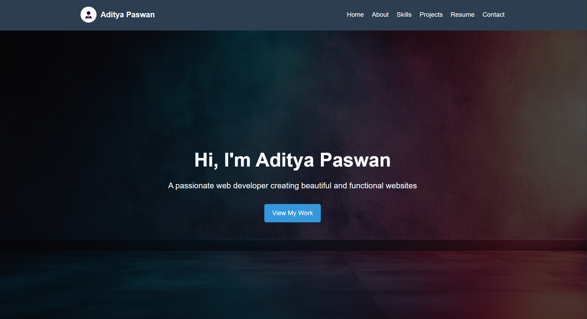
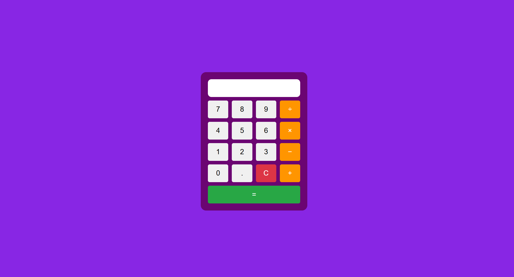

# Web Development Mini Projects

This repository contains **three beginner-friendly frontend projects** created using HTML, CSS, and JavaScript. These projects demonstrate the use of fundamental web development skills and are perfect for building a beginner portfolio.

---

## 🚀 Projects Overview

### 1. 🎨 My Portfolio (HTML, CSS)

A personal portfolio website showcasing your profile, skills, projects, and contact information.

**Features:**
- Clean and responsive design
- Profile section with image
- Skills and projects listing
- Contact form (non-functional placeholder)

**Preview:**  

**Technologies Used:**
- HTML
- CSS

### 2. 🌟 Landing Page (HTML, CSS)

A creative landing page design for a fictional product or service, built with semantic HTML and modern CSS.

**Features:**
- Header with call-to-action
- Product/Service showcase section
- Fully responsive layout
- Clean UI/UX

**Preview:**  

**Technologies Used:**
- HTML
- CSS

### 3. 🧮 Calculator (HTML, CSS, JavaScript)

A simple and functional calculator capable of performing basic arithmetic operations.

**Features:**
- Fully working calculator logic
- Responsive design
- Clear and reset functionality
- Styled user interface

**Preview:**  

**Technologies Used:**
- HTML
- CSS
- JavaScript

## 📁 Project Structure

/web-projects/
│
├── portfolio/
│ ├── index.html
│ ├── style.css
│ └── images/
│
├── landing-page/
│ ├── index.html
│ ├── style.css
│ └── assets/
│
├── calculator/
│ ├── index.html
│ ├── style.css
│ ├── script.js
│ └── icons/
│
└── README.md

